# Project 4: Design Journey

Your Team Name: brown-fox

<!-- **All images must be visible in Markdown Preview. No credit will be provided for images in your repository that are not properly linked in Markdown. Assume all file paths are case sensitive!** -->

## Client Description

<!-- [Tell us about your client. Who is your client? What kind of website do they want? What are their key goals?]

[NOTE: If you are redesigning an existing website, give us the current URL and some screenshots of the current site. Tell us how you plan to update the site in a significant way that meets the final project requirements.] -->

"The Language Expansion Program (LEP) is a student-led program that fosters language learning in a comfortable and encouraging environment for its participants. LEP provides a unique opportunity for individuals in the Cornell community to pursue their interest in language study and to improve their speaking abilities."

Most of us are interested in improving certain language-speaking abilities ourselves, so we thought that working with LEP could help give them the digital publicity they need!

Website goals: "Give information about the org, contact info, get people to come to our events, and be able to join/leave our listserv or notify us that someone wants to join or something to that extent, and maybe a feedback page or something too cause we’re still improving stuff within the org."

Current LEP website: http://orgsync.rso.cornell.edu/org/lep

Since Cornell is phasing out OrgSync, LEP is in need of an independent website for its current and prospective members. We plan to implement a login for the executive board to easily modify information on the website without relying on a third party like OrgSync.

Screenshots of current OrgSync website:

Page 1: Home

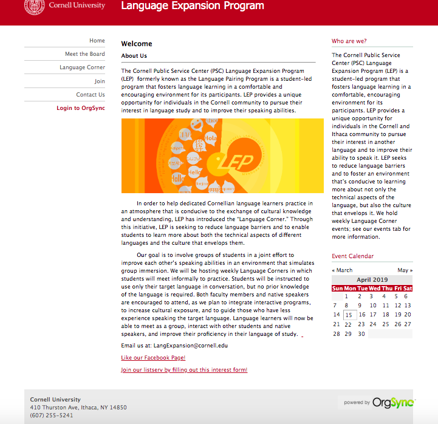

Page 2: Meet the Board

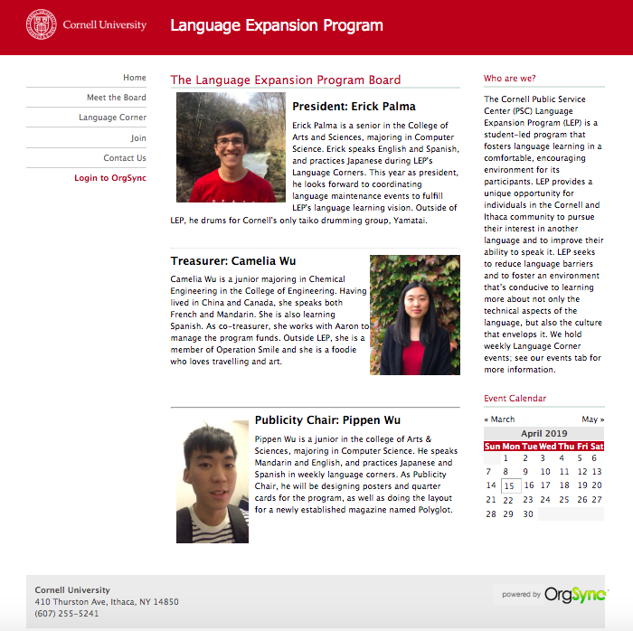

Page 3: Language Corner

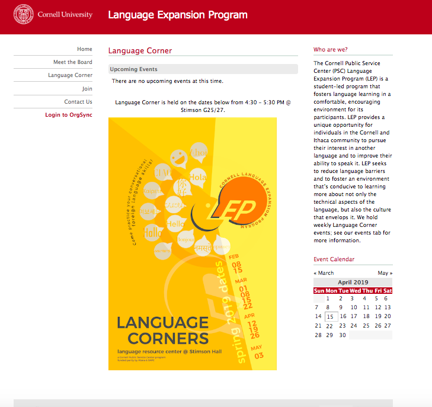

Page 4: Join

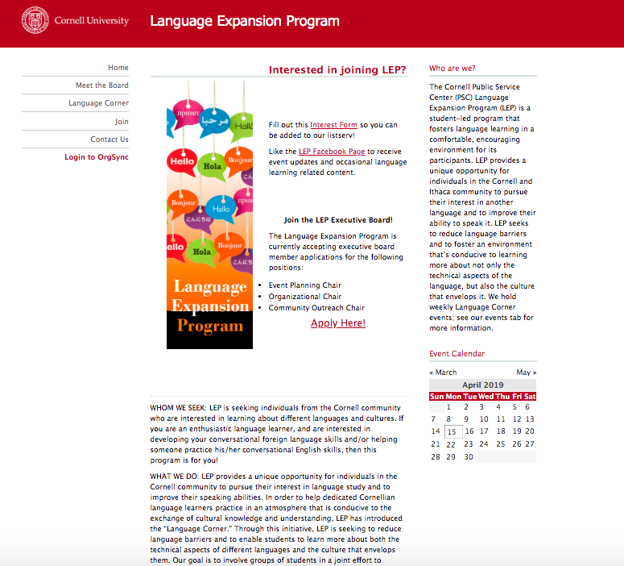

Page 5: Contact Us

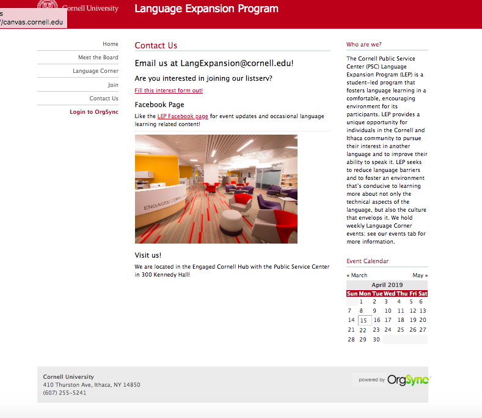

All forms are currnetly links to google forms:

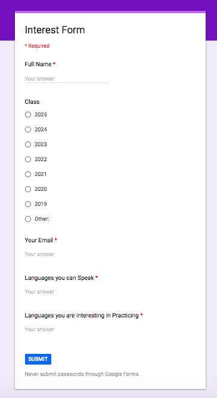
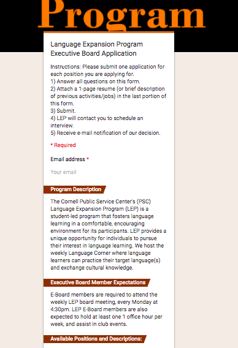
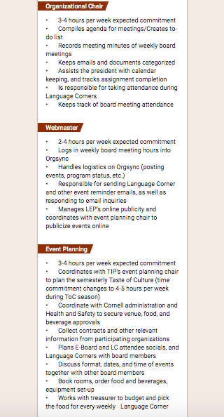
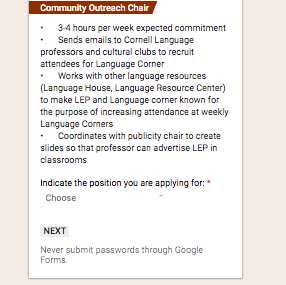


## Meeting Notes

<!-- [By this point, you have met once with your client to discuss all their requirements. Include your notes from the meeting, an email they sent you, or whatever you used to keep track of what was discussed at the meeting. Include these artifacts here.] -->

Notes from client: https://docs.google.com/document/d/1scmZkm8e1J6MTm3WifFjSxH8tpQ9c0NFpBVZblxEllg/edit?usp=sharing

## Purpose & Content

<!-- [Tell us the purpose of the website and what it is all about.] -->

* Give general information about LEP
* Provide LEP contact information & member information for target audience
* Inform target audience of LEP events (and encourage them to attend them)
* Allow target audience to indicate interest in joining listserv
* Allow login for LEP executive board to directly modify parts of the website

## Target Audience(s)

<!-- [Tell us about the potential audience for this website. How, when, and where would they interact with the website? Get as much detail as possible from the client to help you find representative users.] -->

Cornell community (and greater Ithaca community, to a lesser extent) interested in improving proficiency in a foreign language
* Would interact with website to learn more about the organization and its events
* Would also interact with website to indicate interest in joining listserv or executive board

## Client Requirements & Target Audiences' Needs

<!-- [Collect your client's needs and wants for the website. Come up with several appropriate design ideas on how those needs may be met. In the **Rationale** field, justify your ideas and add any additional comments you have. There is no specific number of needs required for this, but you need enough to do the job.]

Example:
- (_pick one:_) Client Requirement/Target Audience Need
  - **Requirement or Need** [What does your client and audience need or want?]
    - Client wants to cater to people who speak different languages.
  - **Design Ideas and Choices** [How will you meet those needs or wants?]
    - Create web-pages manually in multiple languages.
  - **Rationale** [Justify your decisions; additional notes.]
    - Create multiple pages in multiple languages manually. -->

- Client Requirement
  - **Requirement or Need**
    - Client wants to be able to edit parts of the website without going into the code or using a third party
  - **Design Ideas and Choices**
    - Add access controls to edit the site content
    - Show forms & buttons upon login to edit certain parts of the website (e.g. add upcoming events, modify E-Board members shown)
  - **Rationale**
    - Access controls will allow only E-Board members to edit the content of the site
    - Forms & buttons allow for straightforward website editing

- Target Audience Need
  - **Requirement or Need**
    - Audience wants a way to indicate interest in the organization
  - **Design Ideas and Choices**
    - Create interest form for providing contact information/general information
  - **Rationale**
    - Interest form provides a standardized way to indicate interest

- Target Audience Need
  - **Requirement or Need**
    - A certain part of the audience (members of the club) is interested in applying for executive board positions. They need information for the positions available and a way to apply for a position.
  - **Design Ideas and Choices**
    - Create form to apply for eboard position & information about each position
  - **Rationale**
    - Interest form provides a standardized way to indicate interest in applying to become an eboard member and the information about each position gives context to further help the audience know how to apply.


## Initial Design

  Home page: provides basic information about the organization
  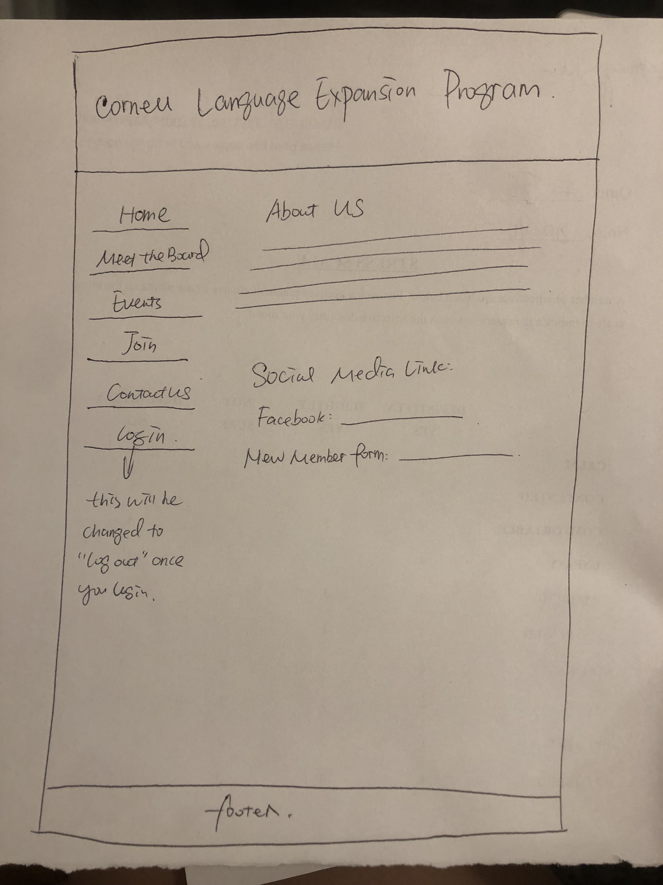

  Image gallery (meet the eboard): gives information about executive board and allows this page to be modified upon login
  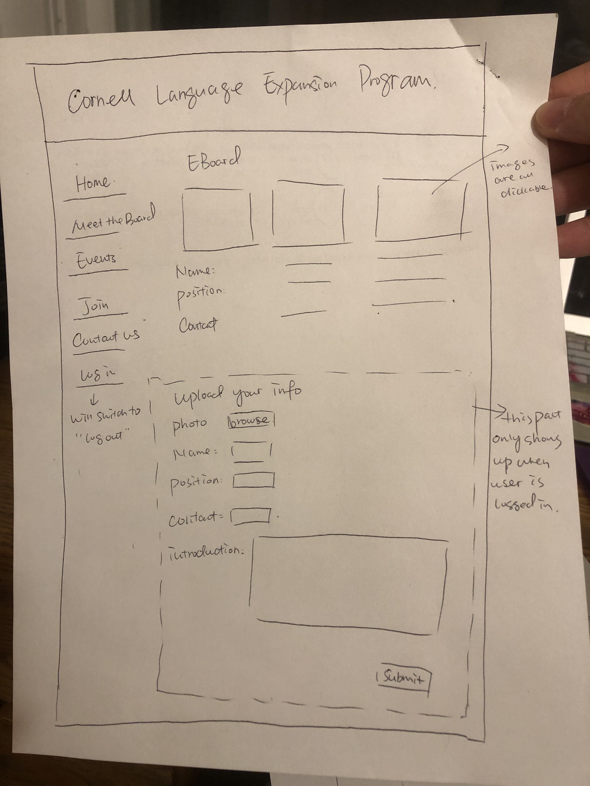

  Image gallery (single image view): shows larger picture & more detailed information for each executive board member
  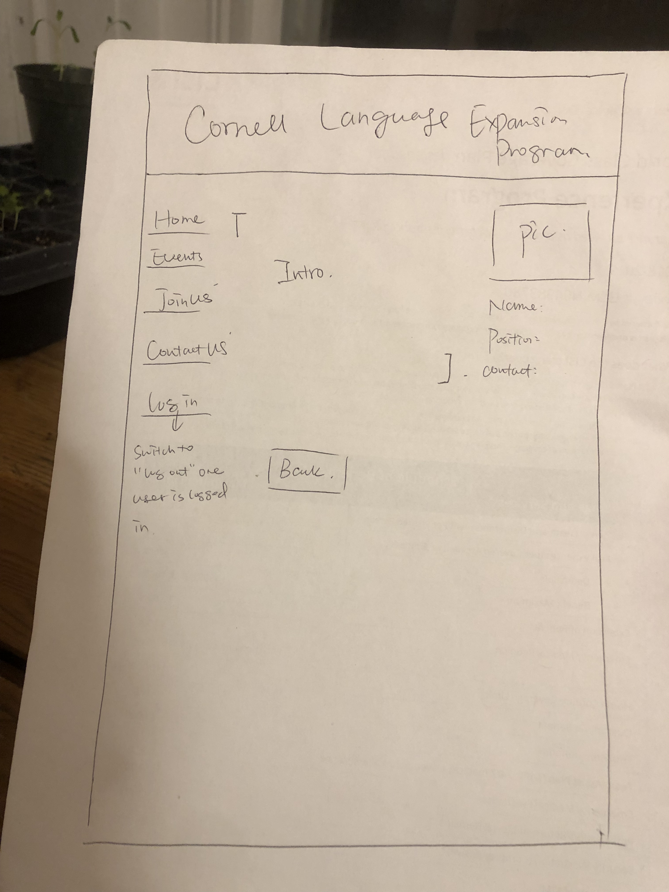

  Join Us page: various forms to indicate interest in the organization
  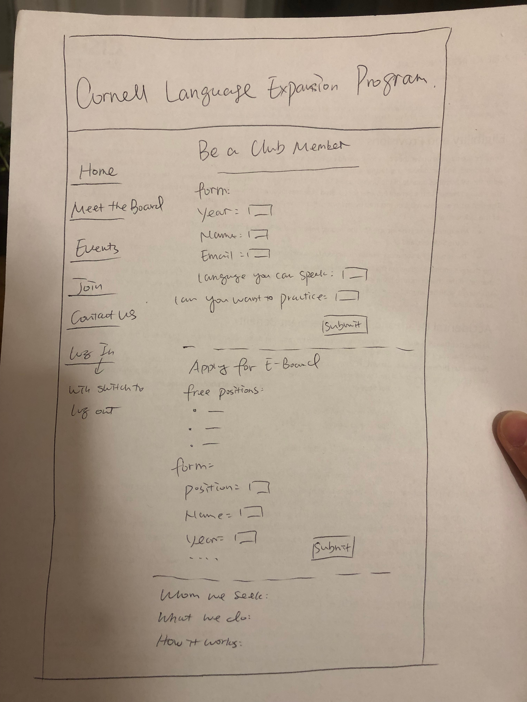

  Contact Us page: provides contact information for the organization
  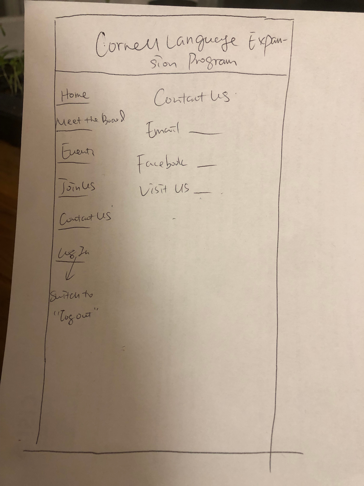

  Login page: incorporates access controls into website
  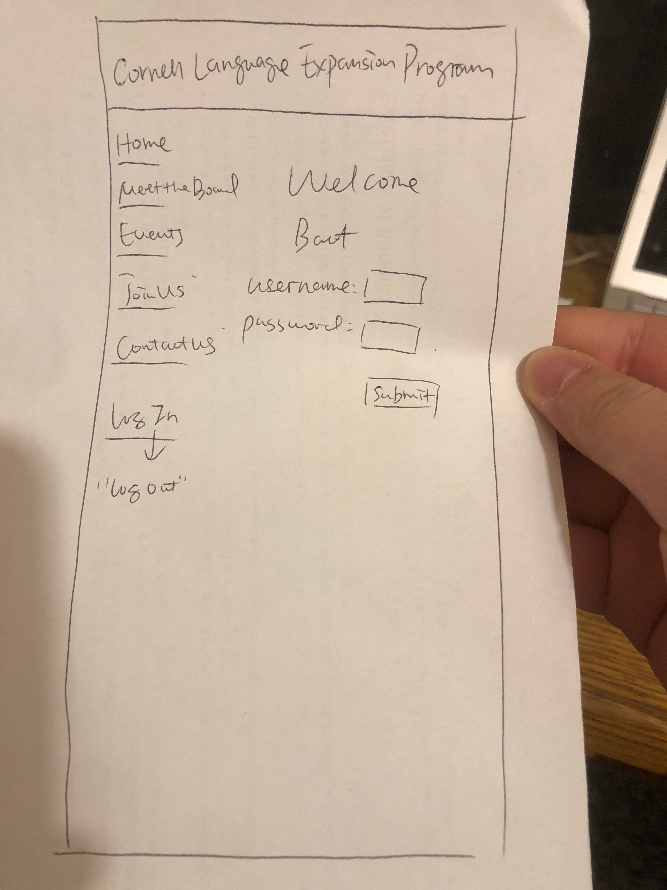

  Add event upon login: allows event page to be modified upon login
  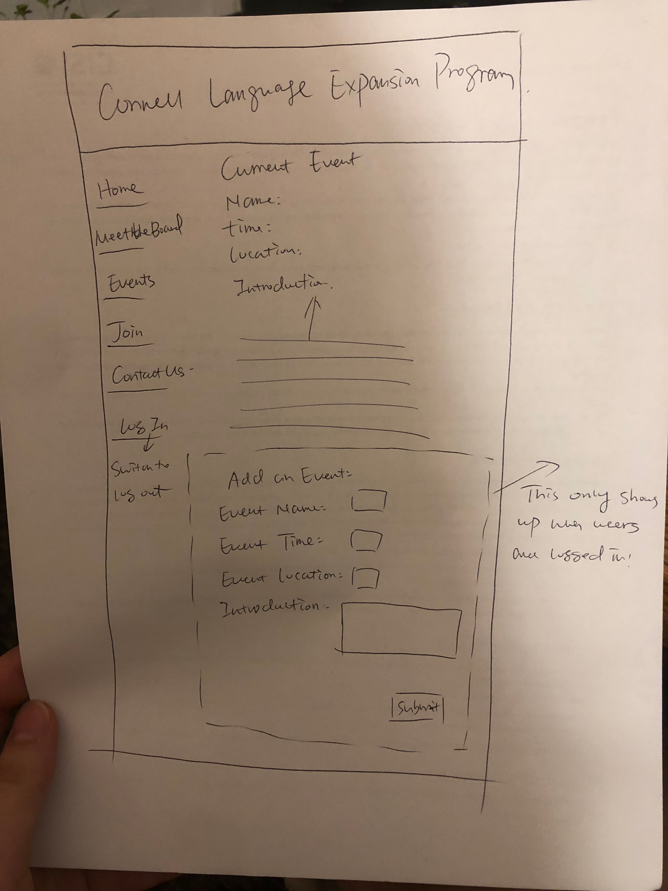


## Information Architecture, Content, and Navigation

<!-- [Lay out the plan for how you'll organize the site and which content will go where. Note any content (e.g., text, image) that you need to make/get from the client.]

[Document your process, we want to see how you came up with your content organization and website navigation.]

[Note: There is no specific amount to write here. You simply need enough content to do the job.] -->

- **Preliminary Navigation Plan**
  - Home
    - About Us
  - Meet the E-Board
    - Image gallery - of each eboard member with information about member
    - Page content can be modified via form
  - Events
    - list of events
    - Page content can be modified via form
  - Join Us
    - Interest Form
    - E-Board application Form
  - Log In/Log Out

- **Content**
  - *Home*: General information about their club and who they are
  - *Meet the Board*: A picture of each EBoard member w/ basic information about them (name, netId, role, bio). If you click to view more details, it opens up to another page with more information about them. If you are logged in to edit the site (via Log In/Log Out page), the photo and information of each EBoard can be editted and an EBoard member can be added or deleted.
  - *Events*: A list of all the events. If logged in to edit (via Log In/Log Out page), you can add and edit events
  - *Join* - a join form and apply to be an eboard member form. If logged in to edit (via Log In/Log Out page) you can access the database of inserted entries.

- **Process**

  All important components of website
  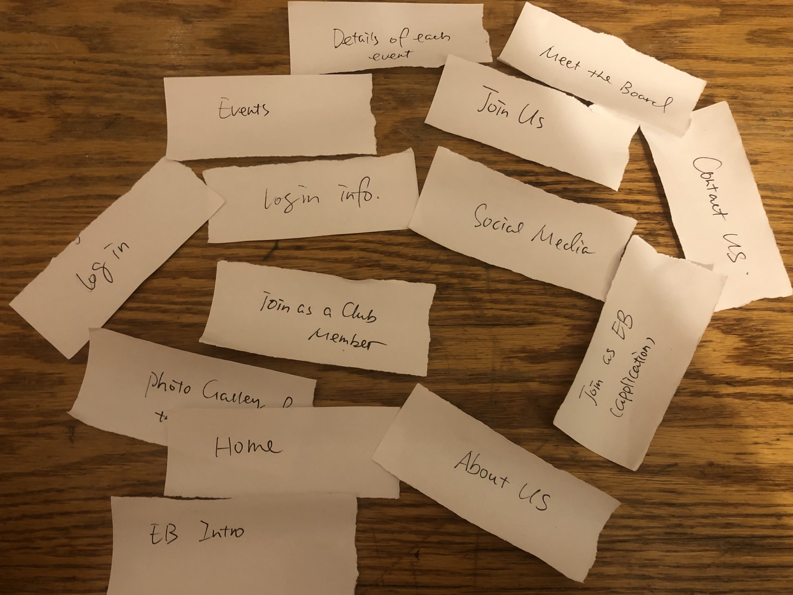

  Home page group
  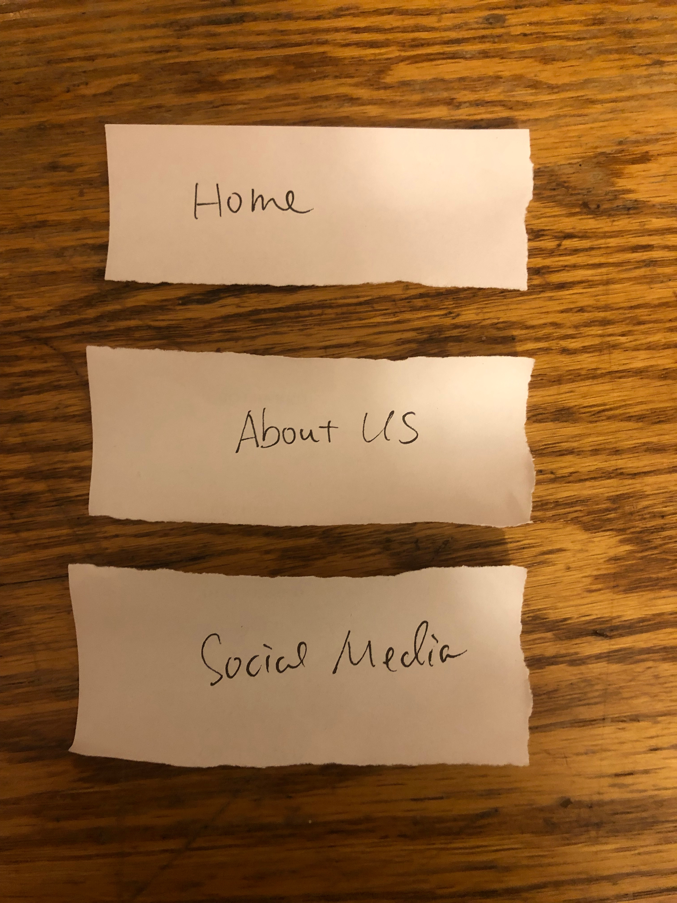

  "Meet the E-Board" group
  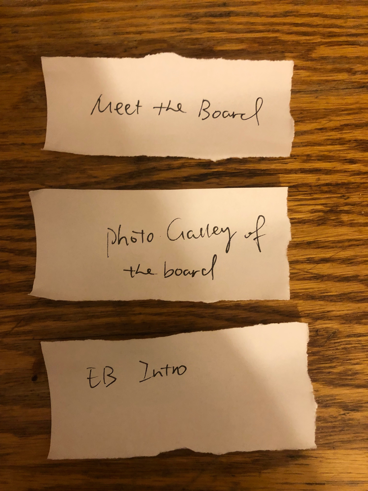

  "Join Us" group
  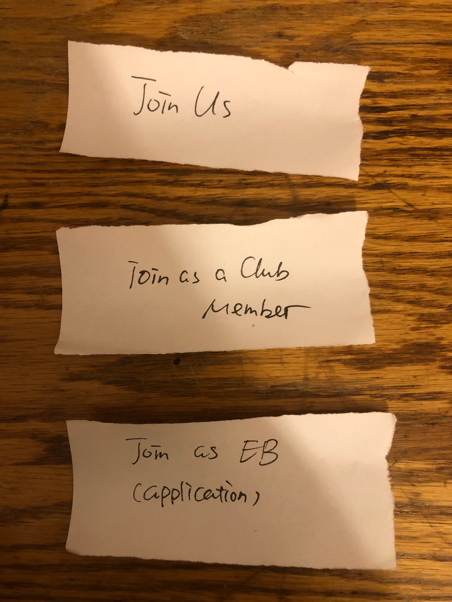

  "Events" group
  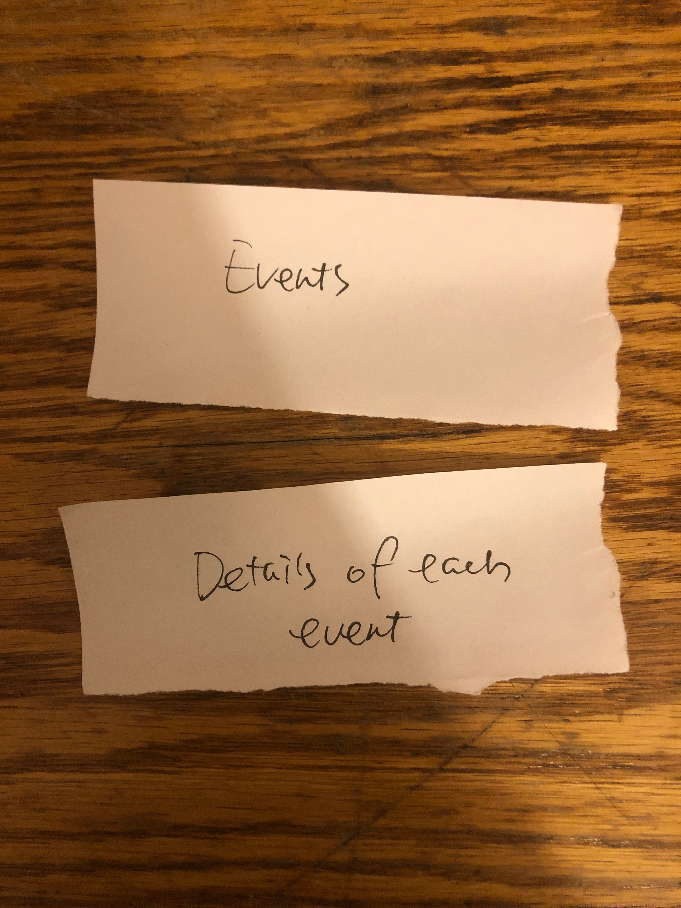

  "Log in" group
  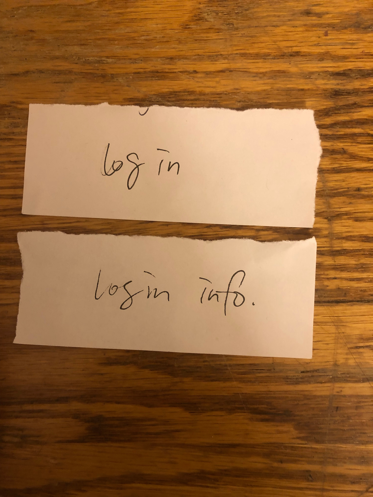

  "Contact Us" group
  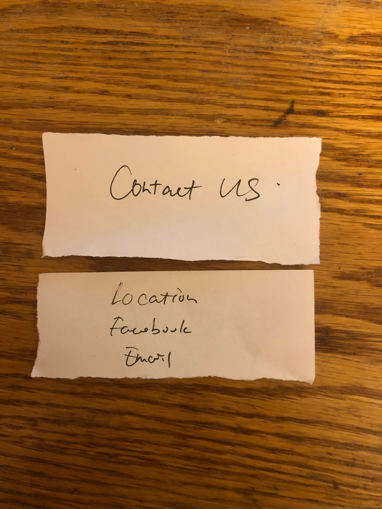

  - Most of the content was already outlined in their previous website, so we adapted most of that information accordingly
  - The client said that they wanted to website to be able to be edited by someone who didn't need to know web development and code, so we added a log in feature to allow the website to be altered.
  - Some content was excluded (such as the calendar view) because it didn't provide sufficient information for events--instead, we will implement a list view for each event
  - Contact Us page was removed because it was just links to their social media (which will be on the footer)

## Interactivity

<!-- [What interactive features will your site have? What PHP elements will you include?]

[Also, describe how the interactivity connects with the needs of the clients/target audience.] -->

Our site will have an edit mode where eboard members will be able to edit their names, bios, and images on the "E-Board" page. This edit mode will be entered upon login. The "E-Board" page will act as an image gallery with a search bar and options to order members by name, title, etc.

Eboard members will also be able to add events to a database which will be programatically included on the "Events" page. Apart from this, admins will be able to add, edit, and delete events.

Moreover, which member is in charge of which event will be able to be indicated which can be added and removed.

The target audience will be able to collapse or expand information about specific events (implemented with JavaScript) depending on their specific interests since each individual may be interested in a different language or event. This also makes the website more visually concise

Additionally, forms to indicate interest and apply to the E-Board will further increase the interactivity of the site for the target audience to express interest in the organization.

By including edit, delete, and add functions for many components of this site, the client's desire for the website to be editable by individuals not adept in web development will be achieved. Our client expressed the desire for the website to be editable by individuals with little to no web development experience, and these inclusions will satisfy the aforementioned need.

## Work Distribution

<!-- [Describe how each of your responsibilities will be distributed among your group members.]

[Set internal deadlines. Determine your internal dependencies. Whose task needs to be completed first in order for another person's task to be relevant? Be specific in your task descriptions so that everyone knows what needs to be done and can track the progress effectively. Consider how much time will be needed to review and integrate each other's work. Most of all, make sure that tasks are balanced across the team.] -->

**Responsibilities**

(Although we will delegate loose roles, they are not exclusive!)

- main form of communication with client - Billie
- index.php - Ashley
- general css design - Ashley, Billie, Hahnbee
- login - Ashley
- events page - Billie, Hahnbee, Kenneth
- 'Join Us' form - Genavieve
  - access controls
  - if user is website editor -> access form replies & ability to edit form
- EBoard members image gallery - Kenneth and Hahnbee
  - includes access controls
- JavaScript components - Hahnbee

<!-- ## Additional Comments

[If you feel like you haven't fully explained your design choices, or if you want to explain some other functions in your site (such as special design decisions that might not meet the final project requirements), you can use this space to justify your design choices or ask other questions about the project and process.]

--- <!-- ^^^ Milestone 1; vvv Milestone 2 -->

## Client Feedback

<!-- [Share the feedback notes you received from your client about your initial design.] -->
Client comments: "The modifying pages stuff doesn’t have to be too elaborate because org details can change. Just need to be able to add events and upload photos/bios when needed."

We didn't previously have a field for uploading images (or uploading other information), so we were sure to incorporate that into our iterated design below.

## Iterated Design

<!-- [Improve your design based on the feedback you received from your client.] -->

 Newly revised version for E-Board file uploading:

 Option to browse & upload a photo for new E-Board members
 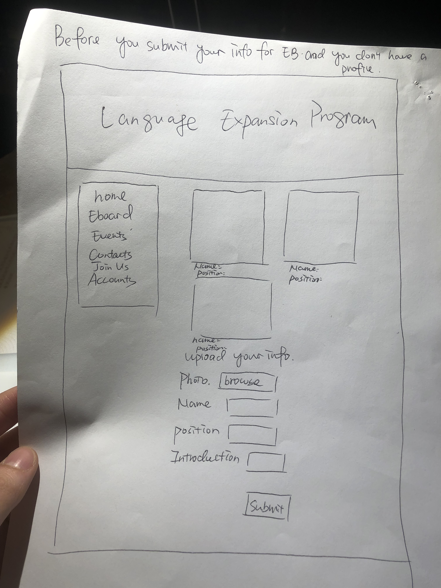

 Also added more visible options to delete components of E-Board and Event pages:

 Updated image gallery page with option to delete a profile
 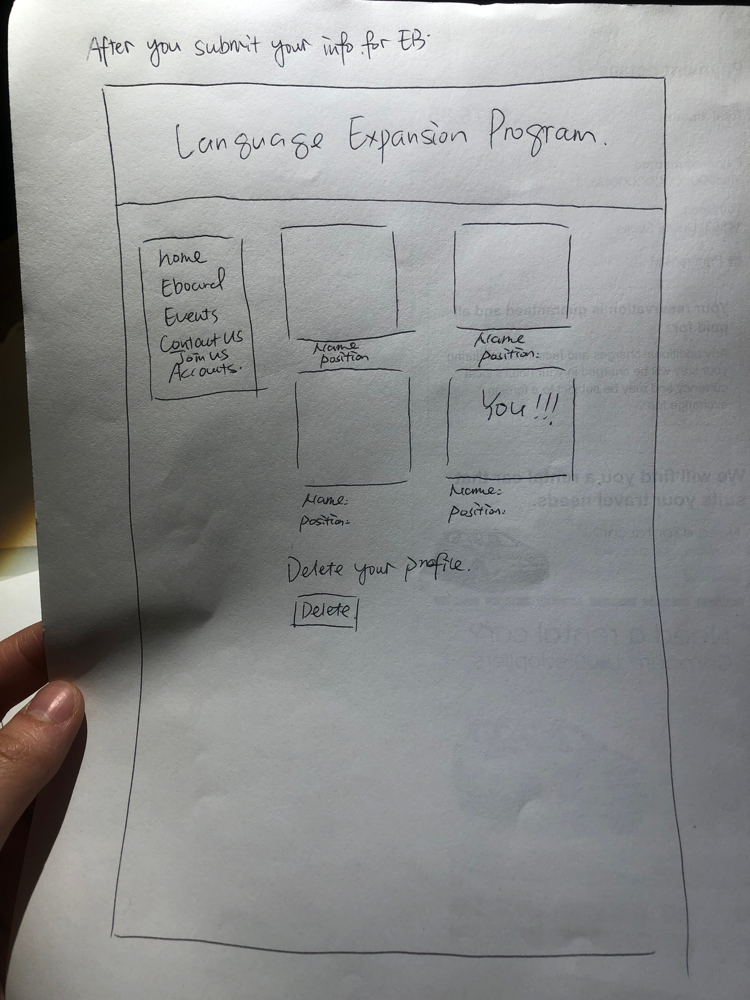

 Option to delete an event if needed
 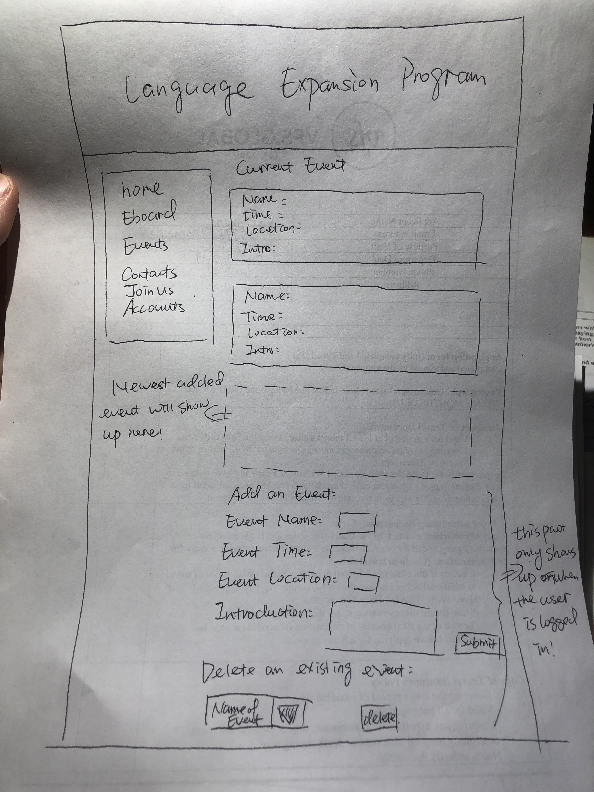

## Evaluate your Design

<!-- [Use the GenderMag method to evaluate your wireframes.]

[Pick a persona that you believe will help you address the gender bias within your design.] -->

I've selected **Abby** as my persona.

I've selected Abby as my persona because the audience of our website is open to the greater Ithaca community which may be less inclined to acquaintence themselves with unfamiliar computing tasks. Abby is also risk averse and prone to blame herself for problems she runs into which is different from us, the website creators. So, by using Abby as our persona, accumatively our and her perspective will allow us to consider a wider perspectives and make our website more inclusive.

### Tasks

<!-- [You will need to evaluate at least 2 tasks (known as scenarios in the GenderMag literature). List your tasks here. These tasks are the same as the task you learned in INFO/CS 1300.]
[For each task, list the ideal set of actions that you would like your users to take when working towards the task.] -->

**Task 1:** Sign up to become an ESP member

Required actions for Task 1:

  1. Navigate to "Join Us" page
  2. Complete interest form
  3. Submit interest form

**Task 2:** Abby has recently become an executive board member and would like to upload her information onto the "Meet the Board" page so LEP members can get to know her better

Required actions for Task 2:

  1. Log in
  2. Navigate to "Events" page
  3. Fill in form and upload picture
  4. Submit form

### Cognitive Walkthrough

<!-- [Perform a cognitive walkthrough using the GenderMag method for all of your Tasks. Use the GenderMag template in the <documents/gendermag-template.md> file.] -->

#### Task 1 - Cognitive Walkthrough

**Task 1: Sign up to become an ESP member**

**Subgoal #1 : Sign up to become an LEP member**

  - Will [Abby] have formed this sub-goal as a step to their overall goal?
    - Yes, maybe or no: [yes]
    - Why? (Especially consider [Abby]'s Motivations/Strategies.)

    Abby uses technologies to accomplish her tasks. Her end goal is to become a club member, so since she is motivated to accomplish this task, she will recognize that this is a necessary step to reach her end goal.

**Action #1A : Press on 'Join Us' link**

  - Will [Abby] know what to do at this step?
    - Yes, maybe or no: [yes]
    - Why? (Especially consider [Abby]'s Knowledge/Skills, Motivations/Strategies, Self-Efficacy and Tinkering.)
      Abby performs tasks using familiar and predictable features, and links are a familiar and predictable way to navigate through a website.

  - If [Abby] does the right thing, will she know that she did the right thing, and is making progress towards her goal?
    - Yes, maybe or no: [yes]
    - Why? (Especially consider [Abby]'s Self-Efficacy and Attitude toward Risk.)
    Yes, because the link will direct Abby to the "Join Us" page and she will realize she made progress.

  **Subgoal #2 : Fill in form**

  - Will [Abby] have formed this sub-goal as a step to their overall goal?
    - Yes, maybe or no: [yes]
    - Why? (Especially consider [Abby]'s Motivations/Strategies.)
    Her end goal is to become a club member, so since she is motivated to accomplish this task, she will recognize (by scanning the page) that filling in a form is a necessary step to reach this goal.

**Action #2A : Fill out every blank in the form**
  - Will [Abby] know what to do at this step?
    - Yes, maybe or no: [yes]
    - Why? (Especially consider [Abby]'s Knowledge/Skills, Motivations/Strategies, Self-Efficacy and Tinkering.)
    Abby performs tasks using familiar and predictable features, and forms are a familiar and predictable way to indicate interest.


  - If [Abby] does the right thing, will she know that she did the right thing, and is making progress towards her goal?
    - Yes, maybe or no: [yes]
    - Why? (Especially consider [Abby]'s Self-Efficacy and Attitude toward Risk.)
    She will see each blank being filled out and notice progress as she fills out the form.

  **Action #2B : Press 'Submit' button**
  - Will [Abby] know what to do at this step?
    - Yes, maybe or no: [yes]
    - Why? (Especially consider [Abby]'s Knowledge/Skills, Motivations/Strategies, Self-Efficacy and Tinkering.)
    Submit buttons are intuitive and familiar. Typically, when you fill out a form, it requires you to press a button (which Abby should be comfortable doing)


  - If [Abby] does the right thing, will she know that she did the right thing, and is making progress towards her goal?
    - Yes, maybe or no: [maybe]
    - Why? (Especially consider [Abby]'s Self-Efficacy and Attitude toward Risk.)
    Once the submit button is pressed it should indicate a 'Thank you for applying to become a member' to indicate that her form was sent, but this isn't currently specified. With a visible message, Abby will definitely know she reached her goal.

#### Task 2 - Cognitive Walkthrough

**Task 2: Abby has recently become an executive board member and would like to add her information onto the "Meet the Board" page so ESP members can get to know her better**

**Subgoal # 1: Login**

  - Will Abby have formed this sub-goal as a step to their overall goal?
    - Yes, maybe or no: [maybe]
    - Why?
        Abby may not know she has to log in to access the Eboard member features, especially if she is less inclined toward tinkering with the website to find out.

**Action # 1A: Click Login link**

  - Will Abby know what to do at this step?
    - Yes, maybe or no: [yes]
    - Why?
        Clicking to use the navigation bar of a website is a familiar and comfortable task

  - If Abby does the right thing, will she know that she did the right thing, and is making progress towards her goal?
    - Yes, maybe or no: [yes]
    - Why?
        The page updates immediately (which is a familiar response to clicking the navigation bar)

**Action # 1B: Fill in username and password**

  - Will Abby know what to do at this step?
    - Yes, maybe or no: [yes]
    - Why?
        Abby performs tasks using familiar and predictable features, and forms are a familiar and predictable way to log into websites.

  - If Abby does the right thing, will she know that she did the right thing, and is making progress towards her goal?
    - Yes, maybe or no: [yes]
    - Why?
        Because she'll see the different parts of the form being filled out.

**Action # 1C : Press login**

  - Will Abby know what to do at this step?
    - Yes, maybe or no: [yes]
    - Why?
        Pressing a button to complete login is a familiar and intuitive task

  - If Abby does the right thing, will she know that she did the right thing, and is making progress towards her goal?
    - Yes, maybe or no: [yes]
    - Why?
        Because she'll be redirected to the site with access to edit the site.

**Subgoal # 2 : Navigate to "E-Board" page**

  - Will Abby have formed this sub-goal as a step to their overall goal?
    - Yes, maybe or no: [yes]
    - Why?
        Abby performs tasks using familiar and predictable features, and links are a familiar and predictable way to navigate through a website.

**Action # 2A : Click on "E-Board" link**

  - Will Abby know what to do at this step?
    - Yes, maybe or no: [yes]
    - Why?
        Clicking to use the navigation bar of a website is a familiar and comfortable task

  - If Abby does the right thing, will she know that she did the right thing, and is making progress towards her goal?
    - Yes, maybe or no: [yes]
    - Why?
        The page updates immediately (which is a familiar response to clicking the navigation bar)

**Subgoal # 3 : Complete Upload your Info form**

  - Will Abby have formed this sub-goal as a step to their overall goal?
    - Yes, maybe or no: [yes]
    - Why?
        This subgoal relates directly to the task at hand (and Abby typically keeps her focus on the tasks she cares about)

**Action # 3A : Enter information into form and upload photo**

  - Will Abby know what to do at this step?
    - Yes, maybe or no: [maybe]
    - Why?
        Not all fields may be applicable/understandable to her (e.g. "Year" for non-students). Since Abby is less inclined toward tinkering, it might be difficult for her to glean information about the requirements of the form.

  - If Abby does the right thing, will she know that she did the right thing, and is making progress towards her goal?
    - Yes, maybe or no: [no]
    - Why?
        Not clear what fields are required or what will happen if she enters incorrect or incorrectly formatted information (this lack of information is not as compatible with a comprehensive information processing style or a process-oriented learning style)

**Subgoal # 4 : Submit form**

  - Will Abby have formed this sub-goal as a step to their overall goal?
    - Yes, maybe or no: [yes]
    - Why?
        This subgoal is familiar for forms and relates directly to the task at hand (Abby typically keeps her focus on the tasks she cares about)

**Action # 4A : Click "Submit" to submit form**

  - Will Abby know what to do at this step?
    - Yes, maybe or no: [yes]
    - Why?
        Clicking "Submit" to submit a form is a familiar and comfortable task to accomplish the end goal

  - If Abby does the right thing, will she know that she did the right thing, and is making progress towards her goal?
    - Yes, maybe or no: [no]
    - Why?
        No clear indication that the form was successfully submitted and no way to check. With a visible message, Abby will definitely know she reached her goal since she has a comprehensive information processing style.

### Cognitive Walk-though Results

<!-- [Did you discover any issues with your design? What were they? How will you change your design to address the gender-inclusiveness bugs you discovered?]

[Your responses here should be **very** thorough and thoughtful.] -->

We discovered that when a form is submitted, it should indicate that it was successfully completed so that the user can know that they are making progress towards their goal. This is especially helpful for people with comprehensive information processing styles.

Additionally, forms should indicate which elements of the form are required, and making the forms sticky might be helpful as well. This especially accommodates for people like Abby with process-oriented learning styles who may not want to tinker with a form to learn how it functions.

## Final Design

<!-- [Include sketches of your finalized design.]
[What changes did you make to your final design based on the results on your cognitive walkthrough?] -->

Final design - Iteration 1

(Includes file uploads per client feedback + verification that a form was successfully submitted per cognitive walkthrough)

Home page


E-Board image gallery - add a profile


E-Board image gallery - delete a profile


E-Board image gallery - single member view


Events page


Contact Us page


Login page


Join Us page with interest forms
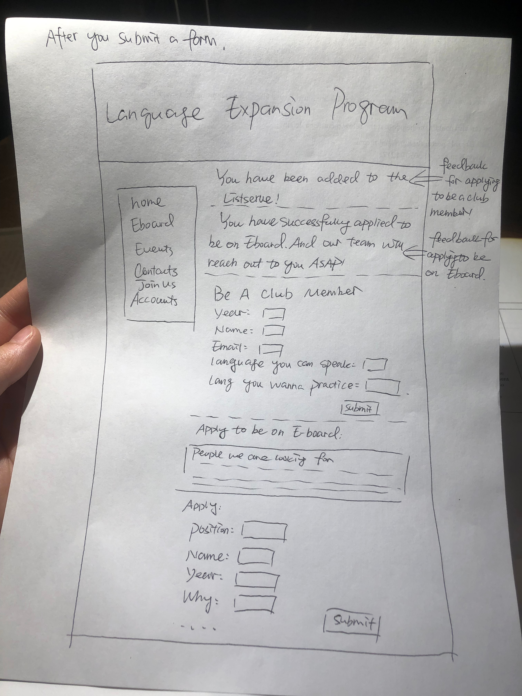


Final design - Iteration 2

As we worked on our website and inputted data and other elements, we realized that there was too much content to fit onto the pages we had designed in the first iteration of the final design. Therefore, we split up some data onto new pages such as ebapps, listservapps, delete_positions, and eventEdit. In addition, we added a footer to display important contact information and cite external resources.

Home page

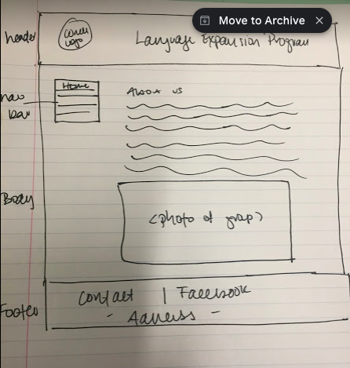

E-Board image gallery

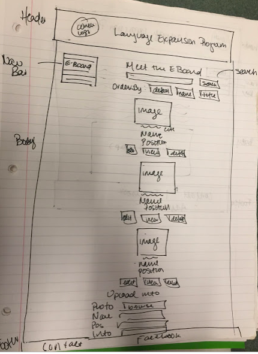

E-Board single image view

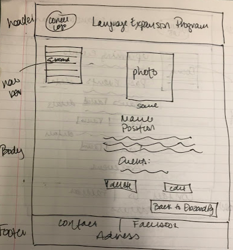

Events page

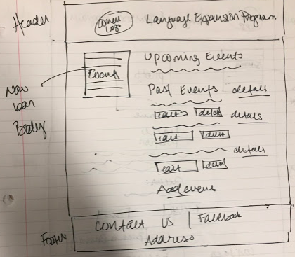

Edit event on Events page upon login

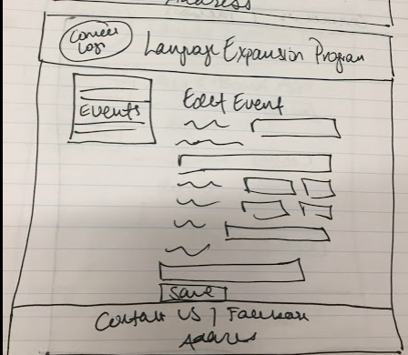

Join Us page

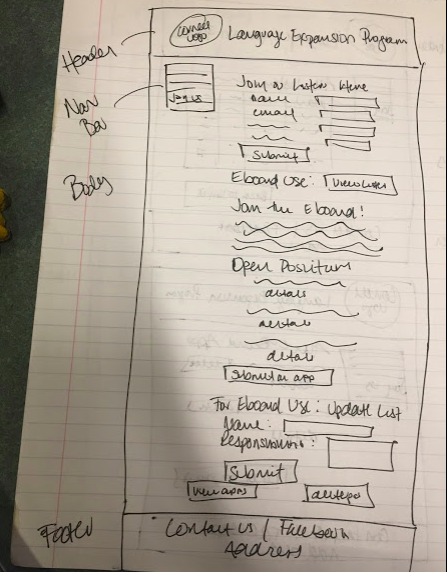

E-Board application linked on Join Us page

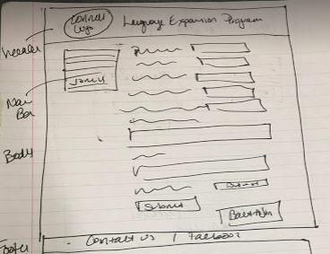

View E-Board applications upon login

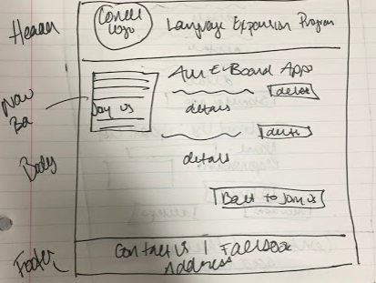

View requests to join listserv upon login

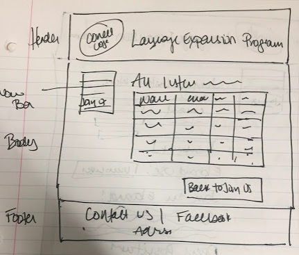

Modify open positions shown on Join Us page upon login


Login page

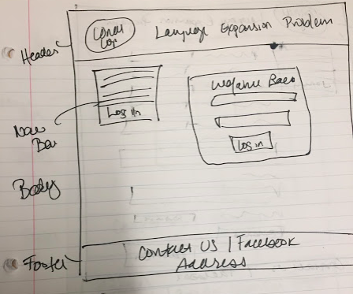

## Database Schema

<!-- [Describe the structure of your database. You may use words or a picture. A bulleted list is probably the simplest way to do this.] -->
```sql

'sessions' {
  	`id` INTEGER NOT NULL PRIMARY KEY AUTOINCREMENT UNIQUE,
    `user_id` INTEGER NOT NULL,
    'session' TEXT NOT NULL UNIQUE
}

'users' (
	`id` INTEGER NOT NULL PRIMARY KEY AUTOINCREMENT UNIQUE,
	`first_name` TEXT NOT NULL,
  'username' TEXT NOT NULL UNIQUE,
  'password' TEXT NOT NULL
);

'events'(
  	`id` INTEGER NOT NULL PRIMARY KEY AUTOINCREMENT UNIQUE,
    `title` TEXT NOT NULL,
    'start_datetime' TEXT NOT NULL, -- must be YYYY-MM-DD HH:MM:SS (24 hour time) format to be used in queries
    'end_time' TEXT NOT NULL,
    'location' TEXT NOT NULL,
    `description` TEXT
);

'listerv' (
  	`id` INTEGER NOT NULL PRIMARY KEY AUTOINCREMENT UNIQUE,
    `fullname` TEXT,
    `email` TEXT,
    'class' INTEGER,
    'speak' TEXT,
    'practice' TEXT
);

'positions'(
  	`id` INTEGER NOT NULL PRIMARY KEY AUTOINCREMENT UNIQUE,
    `title` TEXT NOT NULL
);

'responsibilities'(
  	`id` INTEGER NOT NULL PRIMARY KEY AUTOINCREMENT UNIQUE,
    `position_id` TEXT NOT NULL,
    'responsibility' TEXT NOT NULL
);

'applications'(
  	'id' INTEGER NOT NULL PRIMARY KEY AUTOINCREMENT UNIQUE,
    'position' TEXT NOT NULL,
    'full_name' TEXT NOT NULL,
    'netid' TEXT,
    'graduation' TEXT,
    'college' TEXT,
    'major' TEXT,
    'phone' TEXT,
    'languages' TEXT,
    'credits' TEXT,
    'other_activities' TEXT,
    'why' TEXT,
    'what_skills' TEXT,
    'time_commitments' TEXT,
    'time_management' TEXT,
    'file_name' TEXT,
    'file_ext' TEXT
);

'eboard' {
  'id' INTEGER NOT NULL PRIMARY KEY AUTOINCREMENT UNIQUE,
  'name' TEXT NOT NULL,
  'position' TEXT NOT NULL,
  'bio' TEXT NOT NULL,
  'extension' TEXT NOT NULL
}

'eboard_events' (
  	`id` INTEGER NOT NULL PRIMARY KEY AUTOINCREMENT UNIQUE,
    'event_id' INTEGER NOT NULL,
    'eboard_id' INTEGER NOT NULL
);
```
## Database Queries

<!-- [Plan your database queries. You may use natural language, pseudocode, or SQL.] -->

```
'query to select all data for the meet the eboard page
SELECT * from eboard

'query to select all data for the events page
SELECT * from events

'query to view one eboard member
SELECT * from eboard WHERE id="";

'query to edit eboard member data
UPDATE eboard
SET name = value1, position = value2, bio=value3, extension=value4
WHERE id="";

'query to edit event data
UPDATE events
SET id = value1, title = value2, time=value3
WHERE id="";

'query to search for eboard member
SELECT id FROM eboard WHERE name LIKE '%' || :searchval || '%'
UNION
SELECT id FROM eboard WHERE position LIKE '%' || :searchval || '%'
UNION
SELECT id FROM eboard WHERE bio LIKE '%' || :searchval || '%'

'query to delete eboard member
DELETE FROM eboard WHERE id="";

'query to delete event
DELETE FROM event WHERE id="";

'query to enter review
INSERT INTO events('title','start_datetime','end_time','location', 'description') VALUES(:title, :start_datetime, :end_time, :location, :description);

'query for ordering data by different factors
SELECT * FROM eboard ORDER BY x

'query for inserting eboard members
INSERT INTO eboard(name, position, extension, bio) VALUES (:name, :position, :extension, :bio);

'query for inserting application
INSERT INTO applications (position, full_name, netid, graduation, college, major, phone, languages, credits, other_activities, why, what_skills, time_commitments, time_management) VALUES (:position, :full_name, :netid, :graduation, :college, :major, :phone, :languages, :credits, :other_activities, :why, :what_skills, :time_commitments, :time_management)

'deleting application position
DELETE FROM positions WHERE id=:posid

'deleting event
DELETE FROM events WHERE id = :id;

'deleting all tags related to event
DELETE FROM eboard_events WHERE event_id = :id;

'deleting specific event to member relationship
DELETE FROM eboard_events WHERE id = :id;

'inserting member to event relationships
INSERT INTO eboard_events(eboard_id, event_id) VALUES (:eboard_id, :event_id);

'selecting events that have already happened
SELECT * FROM events WHERE start_datetime < :now;

'selecting events that are to happened
SELECT * FROM events WHERE start_datetime > :now;

'selecting eboard members linked to an event
SELECT name, eboard_events.id AS id FROM eboard INNER JOIN eboard_events ON eboard_id= eboard.id WHERE event_id=:event_id

'inseting into listserv
INSERT INTO listerv (fullname, class, speak, practice) VALUES (:fullname, :class, :speak, :practice)

'selecting responsibilities
SELECT responsibilities.responsibility FROM positions INNER JOIN responsibilities ON positions.id = responsibilities.position_id WHERE positions.title = :position;

'inserting position into table
INSERT INTO positions (title, description) VALUES (:title, :description )

'deleting listserv entry
DELETE FROM listerv WHERE id=:l_id

'selecting listserv items
ELECT * FROM listerv

'query to edit member data
UPDATE eboard SET position = :position, name = :name, bio=:bio, extension=:extension WHERE id=:id

'selecting specific eboard member
SELECT * FROM eboard WHERE id=:eboardid

'deleting eboard member
DELETE FROM eboard WHERE id=:memberid

'deleting all relationships assosciated with eboard member
DELETE FROM eboard_events WHERE eboard_id=:memberid

'selecting events assosciated with eboard member
SELECT title, eboard_events.id AS id FROM events INNER JOIN eboard_events ON event_id= events.id WHERE eboard_id=:eboard_id

```
## PHP File Structure

* index.php - main page. This includes general information about the organization
* accounts.php - This is the page on which users will be able to log into their account (login page)
* contacts.php - This page holds the forms that allow users to contact the organization.
* eboard.php - This page holds the information about the current E-Board members. When the photo of one eboard member is selected it will redirect to a personal page with more information about the individual.
* events.php - This page displays the information for upcoming events and allows users who have logged in to add an event.
* join.php - This page contains the form that allows users to join the club as well as apply to be on the eboard of the club.
* includes
  * init.php - functions/etc that are useful for every web page.
  * cover_pic.php - this template serves as the header for all pages on the website and includes an image of greetings in different languages.
  * footer.php - this template is the footer to be used on all pages. It includes the physical address of the organization.
  * join_us.php - is the template that containts the form to be used by users who want to join the club (listerv sign up)
  * log_in.php - this template containts the form that users can use to log in and out as well as a function to display functions the user may need to read while logging in.
  * logout.php - this template contains the form for users to log out on.
  * navigation bar - this template containts the navigation bar that will appear on all pages of the site as well as the code that allows users to know which page they are on.


## Pseudocode

* index.php
  - includes init.php
  - includes cover_pic.php
  - includes navigation_bar.php

  - BODY TEXT: About the org

  - includes footer.php

* accounts.php
  -  includes init.php
  - includes cover_pic.php
  - includes navigation_bar.php

  - if statement: if user is LOGGED IN
    - display a congratulatory message and a friendly image
  - else:
    - includes log_in.php

  - includes footer.php

* contacts.php
  -  includes init.php
  - includes cover_pic.php
  - includes navigation_bar.php

  - link to org's Facebook page
  - text: email adress
  - includes join_us.php template (listerv sign up)
  - text: we are located in the public service center
  - photo: public service center

  - includes footer.php

* member.php
  -  includes init.php
  - includes cover_pic.php
  - includes navigation_bar.php

  - includes footer.php

  editform
  ```
    if(edit form submitted and user is logged in){

    if(valid is true and no file error){
      begin atomic transaction
      if new image uploaded{
        delete old image
      }
      Sanitize input from all fields
      if(any field is empty){
        set invalid to true
      }
      if (invalid is false){
        store all input in database
      }
      if (uploaded file){
       store uploaded file into uploads folder
      }
      end atomic transaction
    } else{
      set invalid to true
    }
  }

  'error messages output
  if invalid true{
    output error messages
  }

  'for selecting current eboard member
  sanitize and escape data from query string parameter
  using id in query string parameter, select appropiate eboard member

  'function get_extension
  escape id of database entry supplied
  using id obtain from eboard table extension value assosciated with id
  return extension value in database

  'deleting eboard-event relation
  if(user logged on and remove relation button set){
    sanitize and escape input from query string parameter
    delete record which matches specific event-eboard relation
  }

  'deleting eboard member
  if(user is logged on and delete button is set){
    begin atomic transaction
    filter and sanitize input from query string parameter
    obtain extension from database
    delete eboard member matching id supplied in query string parameter
    delete eboard photo from database
    delete all eboard-event relations with aforementioned eboard id
    commit atomic transaction
  }

  'outputting specific member data
  if(get set and nothing else set){
    for specific id supplied by query string parameter output eboard member corresponding to id
    for each relation with specific eboard
      output name of event
      if user is logged in{
        output button for user to delete relation
      }
  }  else if(delete button set){
    Output "member was deleted successfully"
  } else {
    instead of data, output input fields with current data as values
  }
  ```

* eboard.php
  -  includes init.php
  - includes cover_pic.php
  - includes navigation_bar.php
  - create each section with "div"

  --- gallery ---
  - create class = EBoardMember

  --- form ---
  - create form "eboardform"
      - method: Post
      - action: eboard.php
      - input: name, position, contact, introduction, photo
      - submit button

  --- back end ---
  - sanitize all input
  - sql query: INSERT INTO
  - insert info into database

  - includes footer.php

  'submitting new member pseudocode
  ```
  if(form submitted and user is logged in){
    Sanitize input from all fields
    for every text field
    if(field is empty){
      push specific error message for field unto messages array
      set valid to false
    }
    if(valid is true and no file error){
      begin atomic transaction
      obtain image extension
      store all input in database
      store uploaded file into uploads folder
      end atomic transaction
    }
  }
  '''

  'ordering by, search and outputting eboard members code
  '''
  if (order by button clicked andd order by is not default and search is not set) {
    perform order by sql query corresponding to button click
  } else {
    if (search not set){
      perform sql query to obtain all members
    } else {
      sanitize search input
      escape search input
      obtain all search records for aforementioned search input across bio, position and name
    }
  }
  '''

  'eboard_member functionality
  '''
  for every eboard member searched for, or in database{
  Using eboard member record in database fill in details of eboard member in div EboardMember
  }

  if no eboard member supplied{
    output no results found
  }
  '''

  'outputting error messages
  '''
  for every error message in messages{
    output message
  }
  '''
  'access controls
  '''
  if (user is not logged in ){
    don't show view or delete buttons on eboard
    don't show eboard input form
  }

  ````

* events.php - This page displays the information for upcoming events and allows users who have logged in to add an event.
  -  includes init.php
  - includes cover_pic.php
  - includes navigation_bar.php

  - list of all current events (print from database)

  - if statement: is user LOGGED IN
    - form: add a new event
      - event name
      - event time
      - event location
      - description
    - sanitize all input
    - sql query: INSERT INTO
    - insert info into database
  - else:
    - nothing

  - includes footer.php


 ```
  'deleting event
  if(user is logged on and delete button is set){
    begin atomic transaction
    delete event matching id supplied in query string parameter
    delete all eboard-event relations with aforementioned eboard id
    commit atomic transaction
  }

  'inserting data
  if(addevent variable not false){
    escape sanitized data
    put escaped sanitized data into database
    if transaction fails{
      push error message unto messages stack
    } else {
      push confirmation message
    }
    obtain id of record just inserted
    if there are eboard members in-charge{
      for each eboard member{
        sanitize eboard member data
        insert escaped eboard member id and event id into database
      }
    }
    end atomic transaction
  }


```
  'ins

* join.php
- includes init.php
- -define variables

- if: listerv form was submitted
    - sanitize input
    - check to see if all elements are inputted -- user feedback
    - add inputted info to listerv database (INSERT INTO listerv)
    - user feedback: Thanks!!

function: print record positions
- responsibilities INNER JOIN on positions

- if: update positions form is submitted
    - sanitize input
    - check to see if both elements are inputted
    - add inserted input into positions db

- include header
- join our listerv !!
    - for reach: messages
    - form (sticky!)

- if: eboard member is logged in
--> link appears that takes the user to listervapps.php to view all listerv requests

- join the eboard !!!
    - display open opsitions
      - sql: select * from positions
      - for reach position as record:
        - print_record_positions

--> link that takes interested applicants to appform.php

- if: eboard member is logged in
    - form: updated positions db with newly available positions
--> link appears that takes the user to all entered applications
--> link appears that takes users to delete_positions, a table of available positions with the option to delete them

- includes footer

* appform.php
- includes init
- define those variables
- set maximum const size
- if: application submittied
    - sanitize all data
    - check that all required data was provided ---> user feedback
    - if all was inputted:
        - insert data into applications table
        - positive user feedback :)
        - send resume file to uploards/resume
- include header
- include nav bar
- for each appplication --> dispaly messages
- Form: Eboard Application
- include footer

* delete_positions.php
- includes init
- function: print record positions2:
  - table
    - title
    - delete button
- if Delete button clicked:
    - sql: DELETE FROM positions
- includes header
- includes nav bar
- get data: SELECT * FROM position
- for each pos as pos_records
    - print records positions2
- link: back to join us page
- includes footer

* ebapps.php
- includes init
- function: print record app:
  - print: applicaiton of (name of applicant from form)
  - each criteria -- input from user
  - show less button
- if delete selected:
  - DELETE FROM applications
- includes header
- includes nav bar
- begin transaction
- get data: SELECT * FROM applications
- for each piece of data:
  - print record app
- commit db
- link: back to join.php
- includes footer

* listervapps.php
- includes init
- function: print record listerv
  - create table: positions
  - echo data into table
- if delete is selected:
  - DELETE FROM listerv
- includes header
- includes nav bar
- get data: SELECT * FROM listerv
- print record listerv
- link: back to join.php
- includes footer

* includes
  * init.php

  --- all the provided code ---
  --- our code ---
  - create global variable
  - define cookie duration (2 hours)
  - function: log in
    - check for username: SELECT * FROM users WHERE username = :username
    - fetch all records, then check password:
      - if statement: password_verify function
    - if the account exists, add a session to the cookie
    - if the account does not exist display the message "Log in Failed"
- function: find_user -- see if the user exists
  - SELECT * FROM users WHERE id = :user_id
-function: find_session
  - if statement: is the session set
    - SELECT * FROM sessions WHERE session = :session
- function: session_login
  - global $db
  - global $current_user
-  function: is_user_logged_in
  - checks to see if $current_user exists and returns it if it does
- function: log_out:
  - substracts the time left of the cookie duration
    - sets $current_user to null
- trim username and password from log in form: trim( $_POST['user_name/password'])
- call logout - if statement: if $current_user is set (there is someone logged in) and logout is set --> call log_out

  * cover_pic.php
  - insert image (cover_pic)
  - add text (title) on top of the image

  * footer.php
  - text: adress

  * log_in.php
  - for each loop: messages
  - Form:
    - user name
    - password
    - log in

  * logout.php
  - if statement: is_user_logged_in
    - logout: $logout_url

  * navigation_bar.php
  - list: item
    - if statement: title -- echo title
    - href="page_name.php"
    - title to appear on nav bar

--- <!-- ^^^ Milestone 2; vvv Milestone 3 -->

## Issues & Challenges

<!-- [Tell us about any issues or challenges you faced while trying to complete milestone 3. Bullet points preferred.] -->
* refreshing our memory on basic JavaScript for interactive elements
* working as a team and making sure that multiple people don't accidentally work on the same thing
* having to go through the process of reading and understanding someone else's code
* solving merge conflicts (Git log was confusing at times)
* having a comprehensive look on all pages and carefully checking for smaller details

--- <!-- ^^^ Milestone 3; vvv FINAL SUBMISSION-->

## Final Notes to the Client

<!-- [Include any other information that your client needs to know about your final website design. For example, what client wants or needs were unable to be realized in your final product? Why were you unable to meet those wants/needs?] -->
* This wasn't imperative, but including a search or filter option on the Events page--especially for different languages--would have been nice (we prioritized search for E-Board members instead due to time constraints)
* No option for logged-in users to create an entire form or edit a form since it was outside the scope of this class
* No sign-up option to create new accounts (we implemented a shared log-in instead) since it was outside the scope of this class
* The design doesn't currently scale well for mobile (or smaller screens in general) since that was outside the scope of this class
* More cohesive fonts could have been used to bring the design together (but were not thoroughly researched due to time constraints)

## Final Notes to the Graders

<!-- [1. Give us three specific strengths of your site that sets it apart from the previous website of the client (if applicable) and/or from other websites. Think of this as your chance to argue for the things you did really well.] -->

Strengths:

    1. Applicants may upload their resumes directly onto the website rather than emailing it to the club as done before. This will make it easier for students to apply and to keep E-Board applications organized.

    2. Site may be modified directly without using a third party like OrgSync (which Cornell is phasing out). This allows LEP to keep their website up-to-date and provide the most relevant information for their target audience.

    3. LEP aims to foster language learning in a comfortable and encouraging environment, so we intentionally designed our website to look more friendly and inviting than the original OrgSync one (which was relatively bare and impersonal)

<!-- [2. Tell us about things that don't work, what you wanted to implement, or what you would do if you keep working with the client in the future. Give justifications.] -->

Areas of improvement:

    1. Including a search or filter option on the Events page, especially for different languages, would have been useful for a language-learning organization. However, we instead prioritized search for E-Board members due to time constraints

    2. No option for logged-in users to create an entire form or edit a form since it was outside the scope of this class

    3. No sign-up option to create new accounts (we implemented a shared log-in instead) since it was outside the scope of this class

<!-- [3. Tell us anything else you need us to know for when we're looking at the project.] -->

Other notes:

Be sure to try out every button and link since many lead to forms or new pages!
