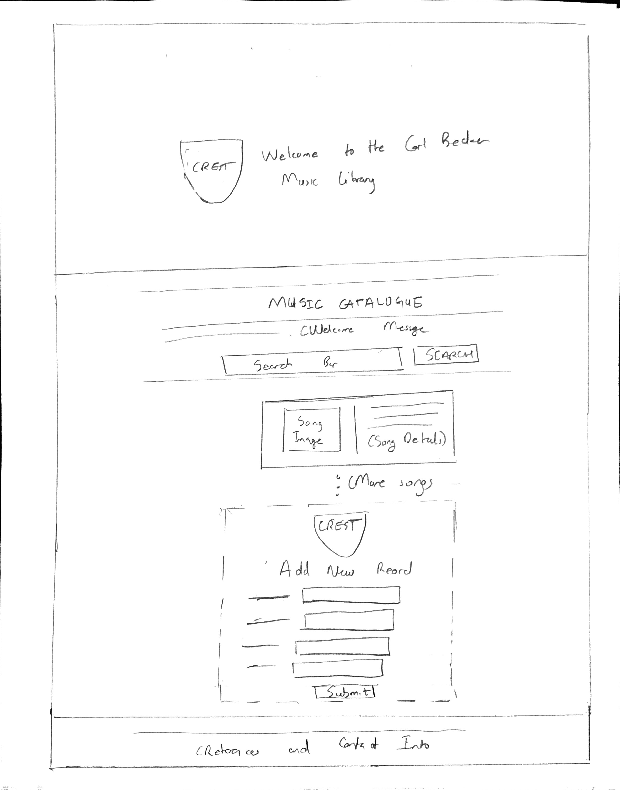
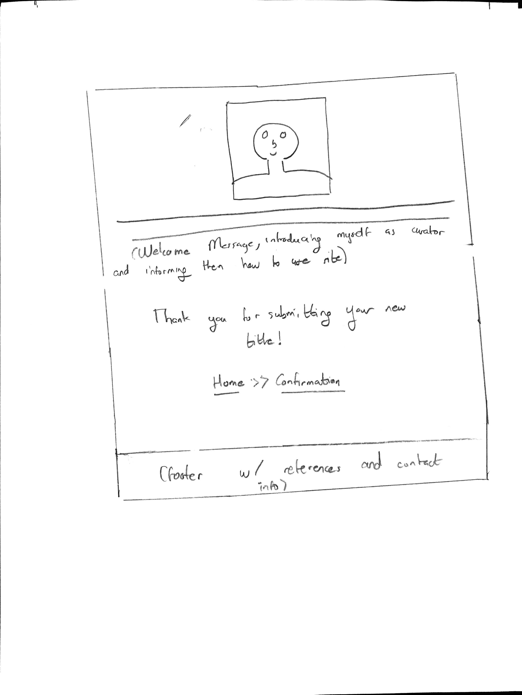

# Project 2: Design Journey

Your Name: Kenneth D. Harlley

**All images must be visible in Markdown Preview. No credit will be provided for images in your repository that are not properly linked in Markdown. Assume all file paths are case sensitive!**

# Project 2, Milestone 1 - Design, Plan, & Draft Website

## Describe your Catalog

[What will your collection be about? What types of attributes will you keep track of for the *things* in your collection? 1-2 sentences.]

My catalogue will be a collection of songs stored in the Carl Becker Music Library. I will keep track of the song title, artist name, genre, year released.

## Target Audiences

[Tell us about your target audience(s).]

My target audience are music lovers who are connected to the Carl Becker House System. They frequently borrow songs from the Carl Becker Music Library


## Design Process

[Document your design process. Show us the evolution of your design from your first idea (sketch) to design you wish to implement (sketch). Show us the process you used to organize content and plan the navigation (card sorting).]

Card Sorting(Brainstorming):


First Homepage Design:

Final Homepage Design:


First Confirmation Page Design:

Final Confirmation Page Design:


[Label all images. All labels must be visible in Markdown Preview.]


## Final Design Plan

[Include sketches of your final design here.]

Final Homepage Design:


Final Confirmation Page Design:


## Templates

[Identify the templates you will use on your site.]

Head. This will contain all my meta tags and all tags in head.

searchNoutput. This will include all my PHP  function definitions and global variables. Additionally here's where the functionality of search, inputting and outputting of records will be implemented.

Footer A footer with references and contact information


## Database Schema Design

[Describe the structure of your database. You may use words or a picture. A bulleted list is probably the simplest way to do this. Make sure you include constraints for each field.]

Table: Songs
* id: The ID of the Record, Not Null, Unique, Auto Increment, Primary Key, Integer
* artist: The name of the artist, Text
* song_title: The name of the song, Not Null, Text
* genre: The genre of the song, Text
* year_released:  The year the song was released, Integer(>0 and <2020)

## Database Query Plan

[Plan your database queries. You may use natural language, pseudocode, or SQL.]

1. All records
SELECT * FROM Songs


2. Search records
```

SELECT * FROM songs
WHERE artist LIKE '%' || :searchvalue || '%'
UNION
SELECT * FROM songs
WHERE song_title LIKE '%' || :searchvalue || '%'
UNION
SELECT * FROM songs
WHERE genre LIKE '%' || :searchvalue || '%'
UNION
SELECT * FROM songs
WHERE year_released LIKE '%' || :searchvalue || '%'"

```
3. Insert record
```
INSERT INTO songs(artist, song_title, genre, year_released)
VALUES (:artist, :title, :genre, :relyear)
```


## Code Planning
```
Sanitize all inputs used
Escape all ouput

Store all images and their info in multidimensional array
For each record:
    Pick random number
    Use number to decide which image to display with record

If (relyear<0 || relyear>2019){
    relyear=null
}

if (title==""|| isnull($title)){
    title= Not Available
}

If (submit button has been set){
    Display Confirmation Page
    Insert records into database
}

if (search has not been set){
     Retrieve All Results (user-defined function: fetch_values)
    For every record in database:
        Output Data in Record into section "musicrecord"(user-defined function: song_details)
} else {
    Retrieve Seach Results (user-defined function: fetch_values)
    For every record in search results:
        Output Data in Record into section "musicrecord"(user-defined function: song_details)
}

[Plan any PHP code you'll need here.]
```

# Final Submission: Complete & Polished Website

## Reflection

[Take this time to reflect on what you learned during this assignment. How have you improved since Project 1? What things did you have trouble with?]

This assignment was very challenging as a lot of the required information was dynamic and hence was being pulled from a database. However, I realized in this scenario it was very necessary, teaching me the importance of learning dynamic web programming. I believe i have become a lot more comfortable with PHP as in this project, using PHP felt almost second nature. I definitely had trouble implementing some of my user-defined functions as I had to use both global and local variables, which took a bit of time to grasp.
