# Project 1: Design Journey

Your Name: Kenneth Dela Harlley

# Project 1, Milestone 1 - Design & Plan

## Website Topic

My Website titled “Visit Ghana” aims at promoting tourism in the West African nation, Ghana. Ghana is known for its bustling nightlife, serene resorts and diverse wildlife hence by highlighting aforementioned aspects of Ghana, much needed foreign direct investment can be generated.

## Target Audiences

**Businesspeople.** These are individuals looking for a vacation or perhaps a serene place to host a business retreat.

**Adventure-seeking youth.** These are young tourists who are looking for experiences, feelings they can’t get anywhere else. They want to be entertained and thrown out of their comfort zones

## Design Process

Card Sorting(Brainstorming):
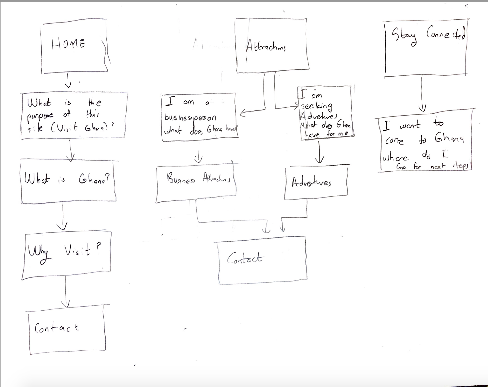

First Homepage Design:
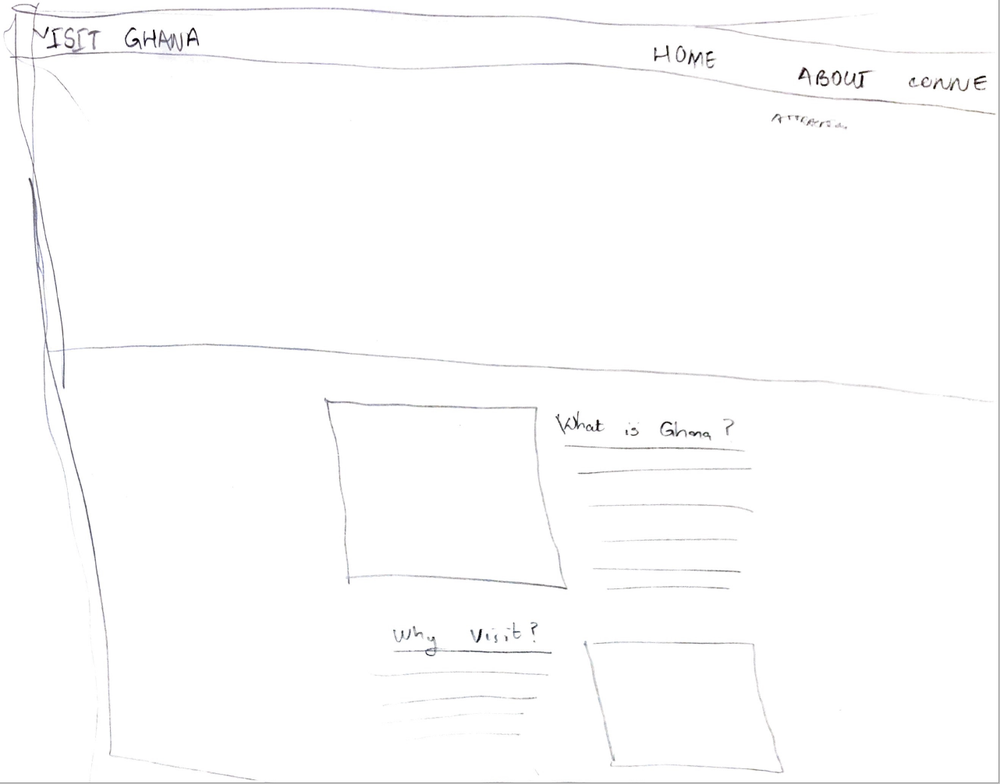
Final Homepage Design:
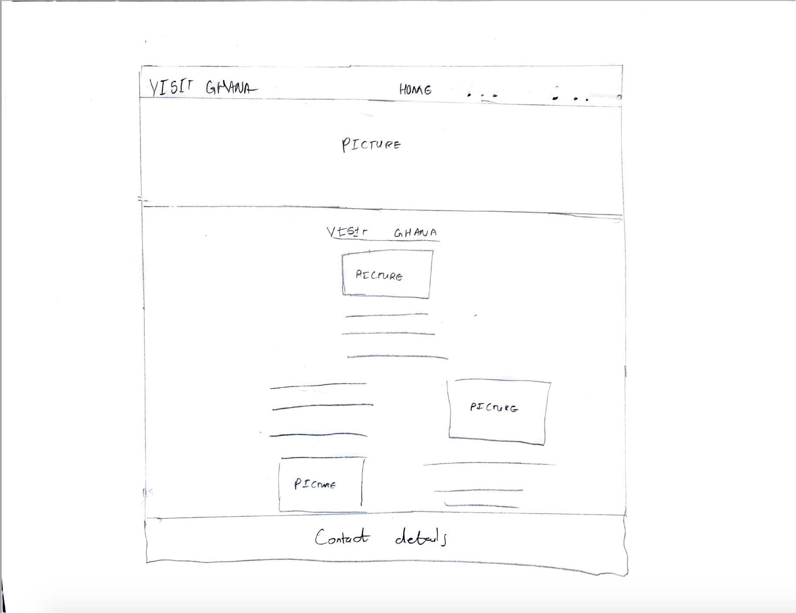

First Attractions Design:
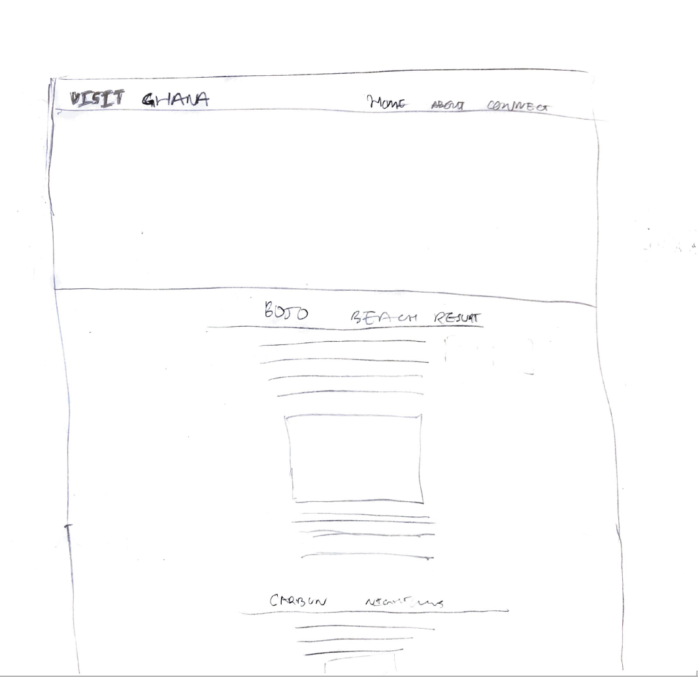
Final Attractions Design:
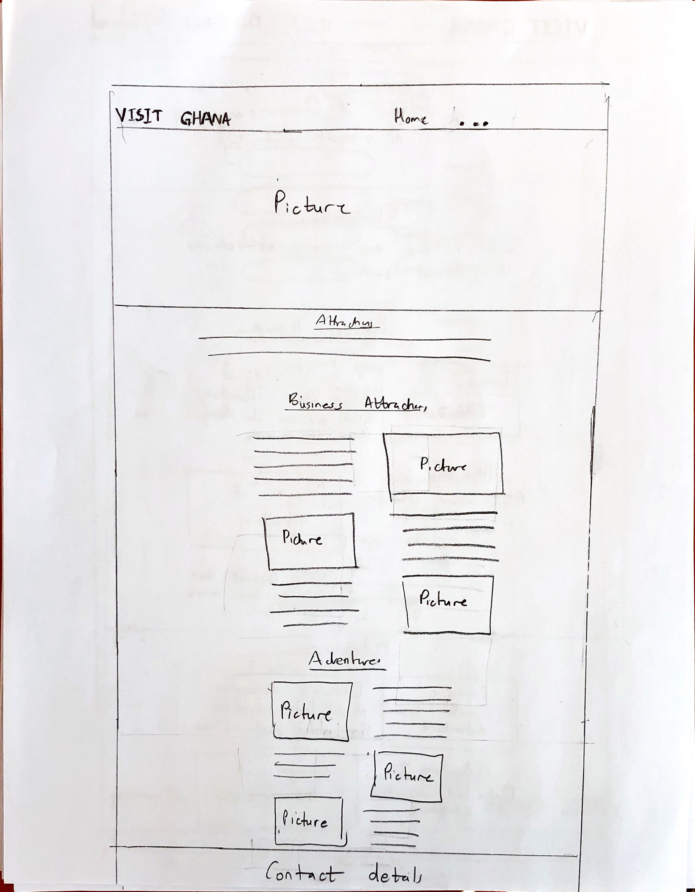

First Stay Connected Design:
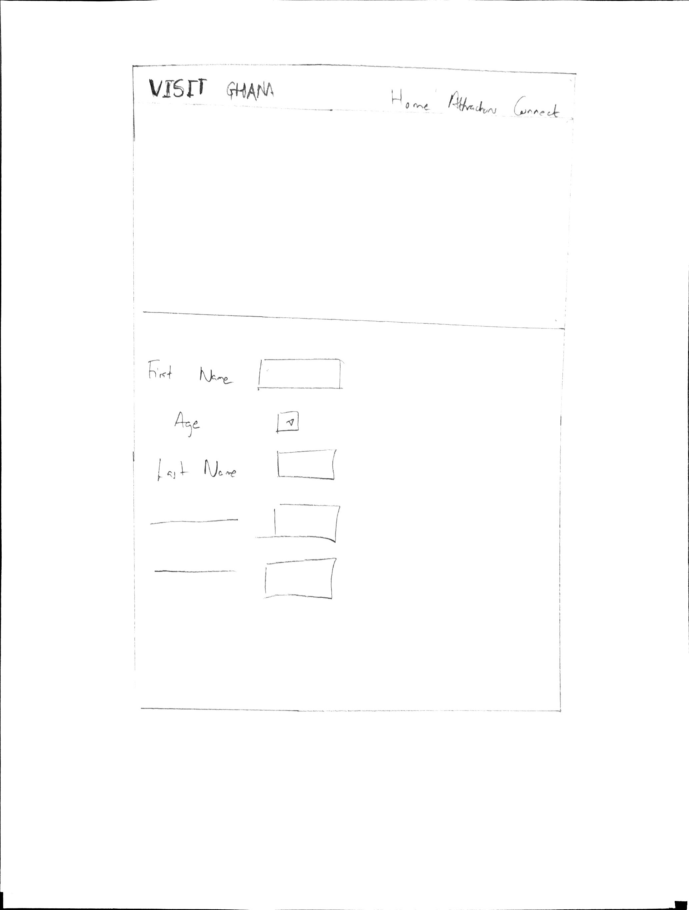
Final Stay Connected Design:
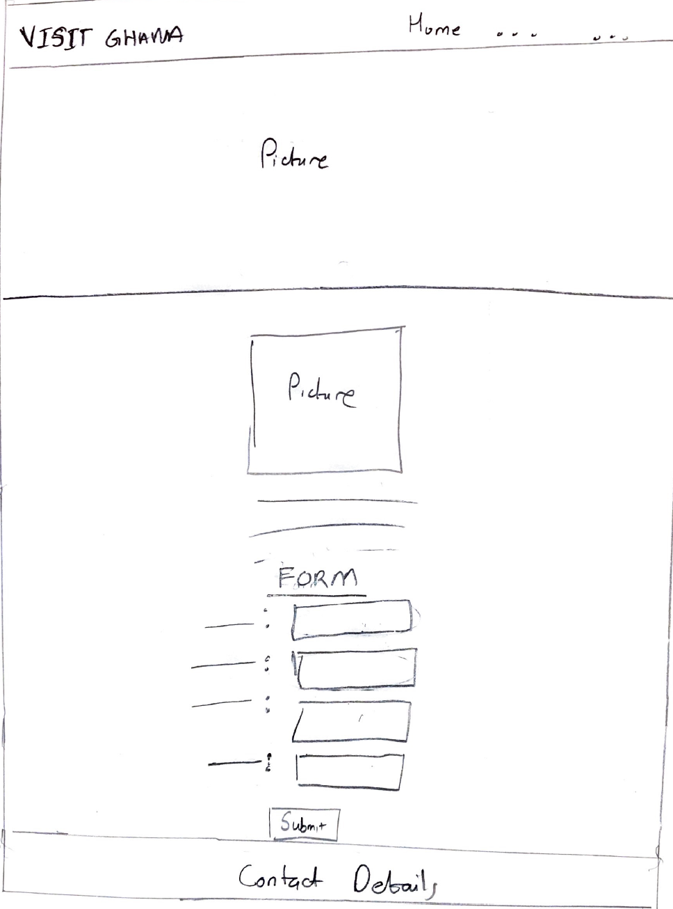

First Confirmation Page Design:
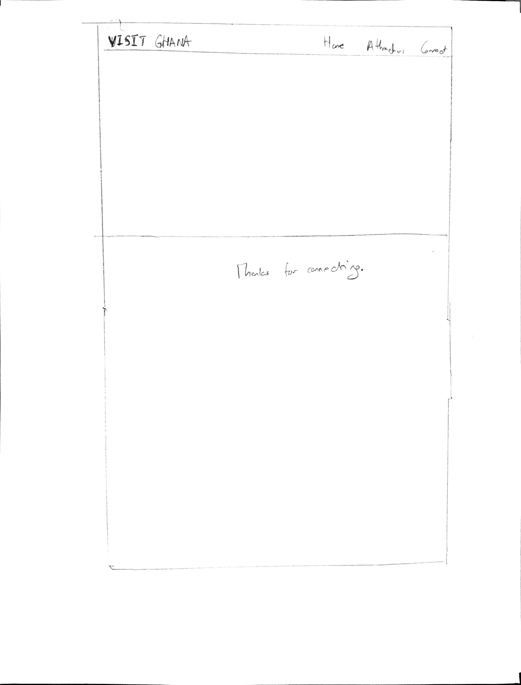
Final Confirmation Page Design:
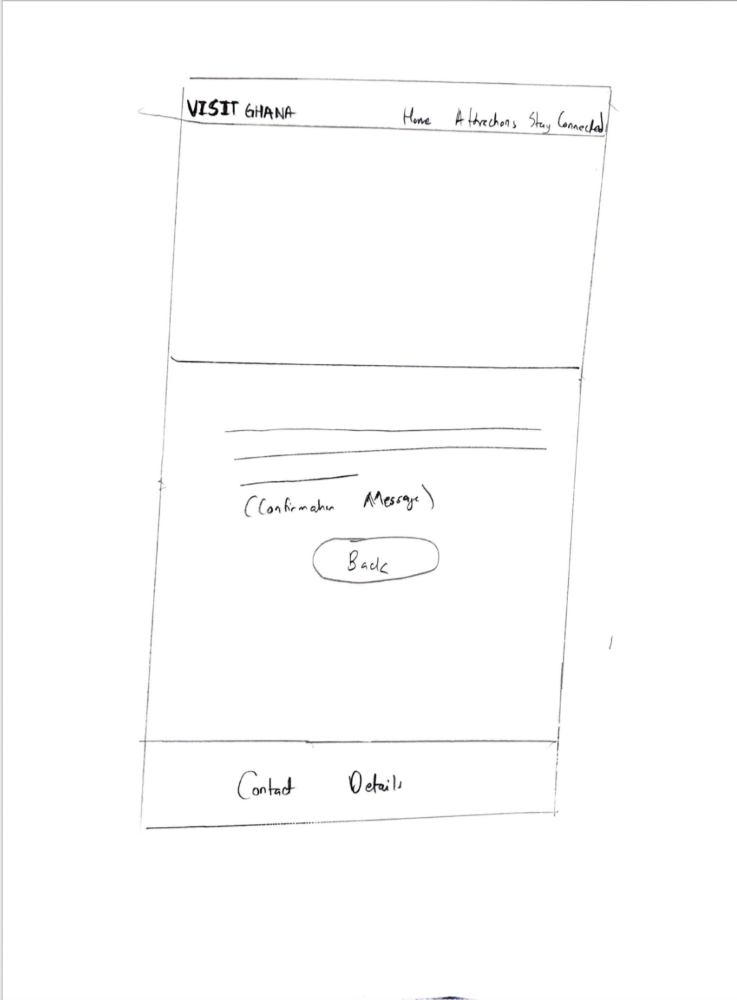

## Final Design Plan

Final Homepage Design:
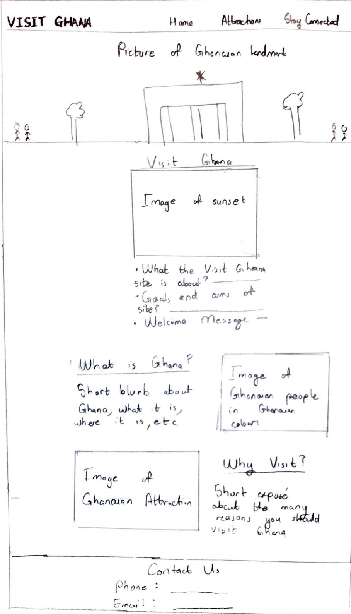

Final Attractions Design:
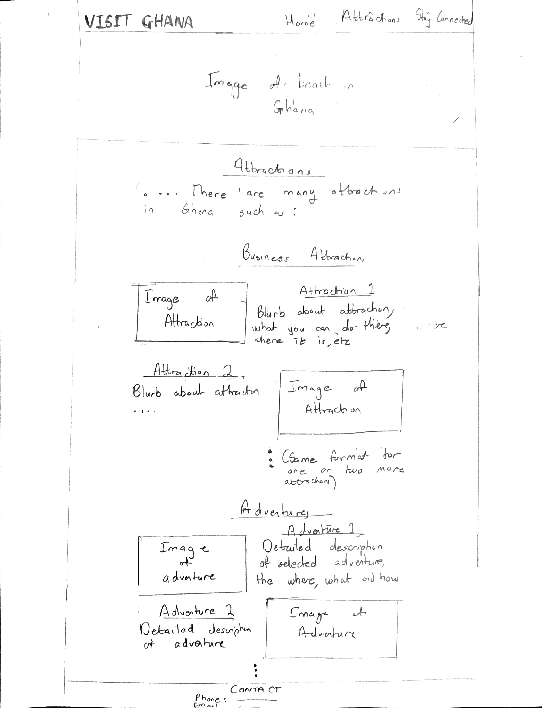

Final Stay Connected Design:
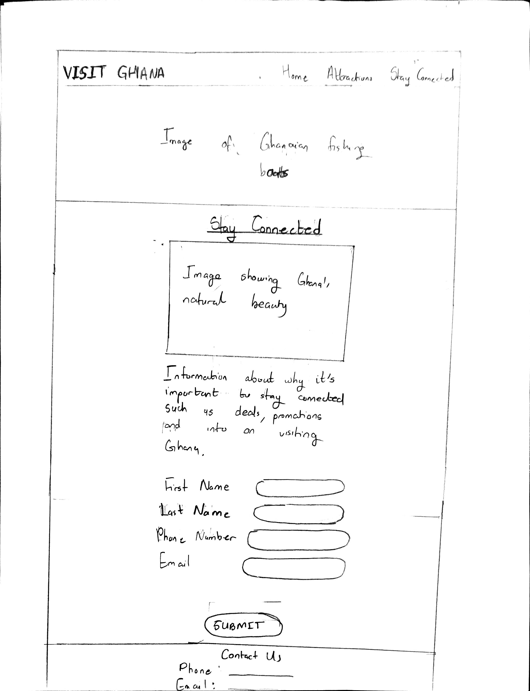

Final Confirmation Page Design:
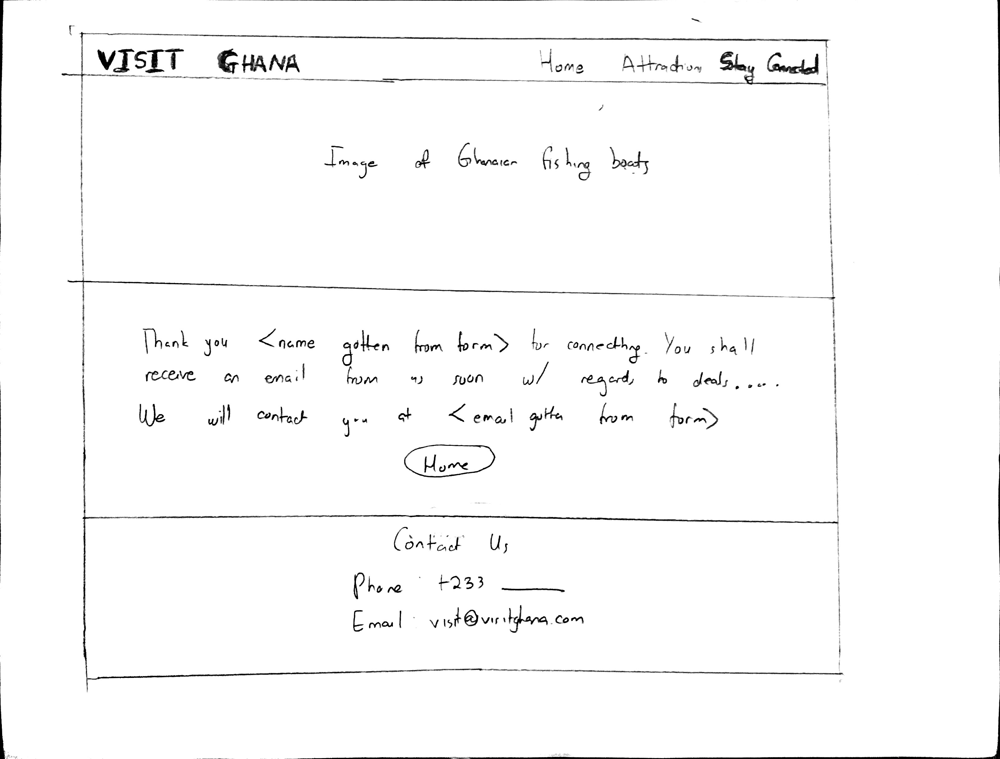

Home
* Desciption on purpose of Visit Ghana Site
* Short Blurb About Ghana
* Short exposé on benefits of visiting Ghana

Attractions
* A selection of Business Attractions.
* A selection of Adventures.

Stay Connected
* Info about importance of staying connected.
* Form with information to help Visit Ghana to stay connected.

Confirmation page
* Confirmation message which leverages information inputted in form

## Target Audiences' Needs

[Businesspeople] By including a selection of business attractions which will include resorts and other serene environments, I am giving a bevy of choices to the employer. Lastly, by including detailed blurbs about these places, business owners can start to get an idea of what preparations to make towards their visits as well as activities they would be allowed to partake in.

[Adventure-Seeking Youth] By including a selection of adventures and not just places, I will entice the adventure-seeking youth. By painting out these adventures explicitly, the youth will easily be able to envision themselves in Ghana as well as fully comprehend the amount of fun which is to be had.

## Templates

My first template will be the navbar, the active page will be bolded on the navbar. Additionally, the large welcoming image below the navbar will also be part of the template and will change depending on what page is active. Additionally, the footer with contact details will also be templated as it's gonna be identical from page to page.

# Project 1, Milestone 2 - Draft Website

## Sticky Form

[What fields are required for your form?]
* First Name
* Last Name
* Email

[Plan out your error messages for your target audiences here.]
* If first name is not valid(empty field) output "You need to input your first name"
* If last name is not valid(empty field) output "You need to input your last name"
* If email is not valid(wrong format or empty field) output "You need to input a valid Email Address"

## Validation Code Plan

[Write out your pseudocode plan for handling the validation of the form.]
* if first name field is empty and form has been submitted
    * Dont Echo hidden
    * Output First Name Error Message
* Else:
    * Echo hidden so no error message is displayed

--

* if last name field is empty and form has been submitted
    * Dont Echo hidden
    * Output Last Name Error Message
* Else:
    * Echo hidden so no error message is displayed

--

* if (email field is empty or email is not valid) and form has been submitted
    * Dont Echo hidden
    * Output Email Error Message
* Else:
    * Echo hidden so no error message is displayed

--

* if form is valid
    * Output Confirmation Page
* Else if form has been submitted
    * Output Error Messages
* Else
    * Output Standard Form

# Final Submission: Complete & Polished Website

## Target Audiences

[Tell us how your final site meets the needs of the target audiences. Be specific here. Tell us how you tailored your design, content, etc. to make your website usable by both target audiences.]

**Adventure-seeking youth.**
For my adventurers, instead of basing my title on the name of the place where the adventure was to be had, I specifically highlighted the adventure. For example, in place of using "Kakum National Park" as my title, I instead said "Walk 43 meters above the ground at Kakum." With this, i got right to the meat of the matter and certainly captured the attention of any adventure-seekers. Additonally, by selecting solely one very eye-catching image of each adventure, I wet the appetite of my adventure-seeking adventures but didn't satify it. As a result, these youth were compelled to sign up on the stay connected page so they could receive more information.

**Businesspeople.**
For my businesspeople looking for vacations or retreats, I included places at these attraction where they could directly envision themselves there. For example looking at the Busua Beach resort image, these businesspeople will imagine themselves sitting in the chairs by the pool soaking in the refreshing African sun. Additionally, each of these places had a text source, where said businesspeople could get more information about the adventures. I decided to include these references as for business retreats, approval will be needed from management hence it is essential the visitor is well-versed on their choosen resort.

**For both audiences**
I included beautiful pictures of Ghana throughout the site so both audiences will be struck by the natural beauty of the country. This natural beauty will stick with them as they navigate throughout the site, where their visual sense will be further excited by other awe-inspiring images. By the end of viewing the site, if the attractions or adventures werent enough for the visitor, they will be compelled to visit Ghana just because of how beautiful it is.  A short blurb about Ghana and why Ghana is the place to visit was included for anyone in either category who might have reservations about visiting Ghana because of previous knowledge about wartorn African countries or simply because they dont know much about Ghana.
## Reflection

[Take this time to reflect on what you learned during this assignment. How have you improved from 1300? What things did you have trouble with?]

This website taught me a lot about how important it is to programmitically indicate content on pages. It is very nice to be able to detect what page a user is on and give tailored feedback. Though it was hard for me to figure out how to switch page content when a form is submitted, I feel it is making me a better programmer and also a better web designer.
